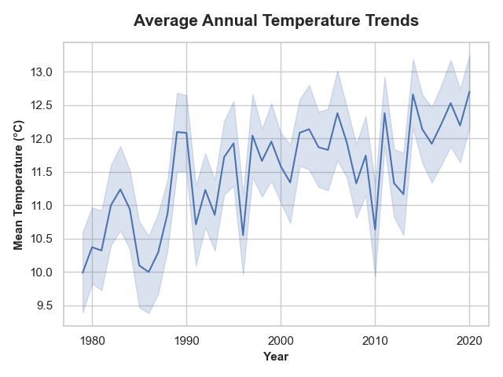
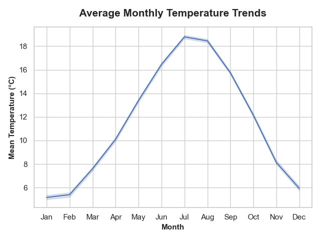
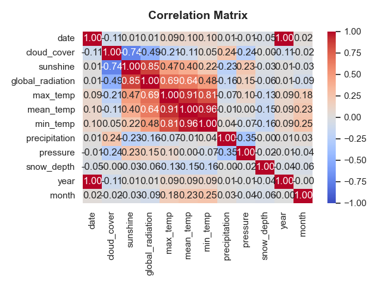

# London Climate & Weather Analysis: Operational Temperature Forecasting with MLflow

## 📌 Abstract
Ambient temperature fluctuations directly impact municipal power grids, heating and cooling demands, and regional infrastructure planning. This project develops a daily temperature forecasting framework for London using over 40 years of continuous meteorological records (1979–2020) containing 15,000+ observations.

To address real-world operational conditions, the feature space is strictly audited to eliminate same-day target leakage from minimum and maximum temperature extremes. Multiple regression algorithms—**Linear Regression**, **Decision Tree Regressor**, and **Gradient Boosting Regressor**—are benchmarked across hyperparameter depths. Leveraging **MLflow** for experiment tracking and artifact serialization, the final **Gradient Boosting model achieves an optimal test RMSE of 2.80°C**, providing reliable forward predictive signals for municipal load balancing.

---

## 📂 Data Ingestion & Preprocessing
The historical dataset comprises daily meteorological readings captured across 10 continuous environmental attributes.

* **Target Variable**: `mean_temp` (Degrees Celsius, °C).
* **Selected Feature Set**: `month`, `cloud_cover`, `sunshine`, `precipitation`, `pressure`, `global_radiation`, and `snow_depth`.

### Preprocessing Pipeline
* **Target Leakage Prevention**: Excluded `max_temp` ($r = 0.91$) and `min_temp` ($r = 0.96$) from features despite high collinearity, as intra-day extremes are unknown prior to daily operational dispatch.
* **Missing Target Handling**: Dropped records missing the target variable `mean_temp` to ensure validation integrity.
* **Data Splitting**: Partitioned observations using an 80/20 train/test split (`random_state=42`).
* **Imputation**: Filled missing values in skewed variables (`snow_depth`, `precipitation`) using median strategy via `SimpleImputer`, fitted strictly on training data.
* **Feature Normalization**: Standardized input dimensions to zero mean and unit variance using `StandardScaler`.

---

## 📈 Exploratory Data Analysis (EDA)
Exploratory workflows evaluated long-term climate trajectories, seasonality patterns, and multi-collinear relationships across atmospheric variables.

### 1. Annual Warming Trajectory

*Figure 1: Mean Annual Temperature Trends in London (1979–2020).*

**Insight:** London's average temperature demonstrates a sustained upward drift, shifting from ~10.0°C in the early 1980s to consistently averaging between 11.5°C and 12.5°C post-2000, punctuated by extreme warm peaks in 2003, 2006, and 2018–2020.

### 2. Cyclical Monthly Seasonality

*Figure 2: Monthly Mean Temperature Distributions across the Annual Cycle.*

**Insight:** Seasonality adheres to a classic temperate curve, reaching winter minimums in January and February (~5.2°C–5.5°C) and peaking during July and August (~18.5°C–18.8°C), confirming calendar month as an essential cyclical predictor.

### 3. Atmospheric Correlation Structure

*Figure 3: Feature Correlation Matrix across Meteorological Predictors.*

**Insight:** Solar irradiance (`global_radiation`) and sunshine duration exhibit strong positive associations with daily temperature, whereas cloud cover and surface pressure act as negative moderators during transitional weather fronts.

---

## 🧠 Model Architecture & MLflow Tracking
Three model paradigms were benchmarked across varying decision boundaries (`max_depth` $\in [1, 2, 10]$):

* **Baseline**: Ordinary Least Squares `LinearRegression`.
* **Non-Parametric**: `DecisionTreeRegressor` evaluating recursive splits.
* **Ensemble**: `GradientBoostingRegressor` optimizing sequential residuals.
* **MLflow Tracking**: Logged hyperparameter runs, out-of-sample RMSE scores, and serialized model artifacts via `mlflow.sklearn.log_model`.

---

## 📊 Results & Performance
Models were evaluated on the held-out 20% test partition using Root Mean Squared Error (RMSE).

| Experiment Run | `max_depth` | Linear Regression RMSE (°C) | Decision Tree RMSE (°C) | Gradient Boosting RMSE (°C) |
| :--- | :---: | :---: | :---: | :---: |
| **`run_0`** | 1 | 3.6558 | 4.6862 | 3.0285 |
| **`run_1`** | 2 | 3.6558 | 3.8551 | **2.8002** |
| **`run_2`** | 10 | 3.6558 | 2.9443 | 2.8097 |

*Figure 4: Logged MLflow Experiment Runs and Artifact Registry.*

---

## 🎯 Strategic Business Recommendations & Implementation
Accurate ambient temperature forecasts allow utilities and facilities managers to optimize operations:

### 1. Champion Model Deployment
* **Operational Production Pipeline**: Deploy the **Gradient Boosting Regressor (`max_depth=2`)** into production. A shallow depth of 2 acts as structural regularization, outperforming deeper trees by mitigating over-fitting on noisy micro-climate shifts.
* **Expected Forecast Margin**: The 2.80°C RMSE margin provides energy traders and grid controllers with a reliable operational baseline for scheduling day-ahead generation without relying on lagged target variables.

### 2. Proactive Energy Demand Planning
* **Peak Load Dispatches**: Leverage summer forecasts breaching 18°C thresholds to prep cooling infrastructure and mitigate peak brownout risks.
* **Fuel Storage Pre-Allocation**: Utilize winter forecast models identifying cold-snap drops below 5°C to dynamically ramp natural gas and district heating supply.

### 3. Continuous Governance with MLflow
* **Model Registry & Drift Auditing**: Use MLflow Model Registry to monitor ongoing forecast residuals against incoming meteorological telemetry, triggering retraining triggers if seasonal drift exceeds 3.2°C RMSE.

---
*© 2026 Ryan Tang.*
